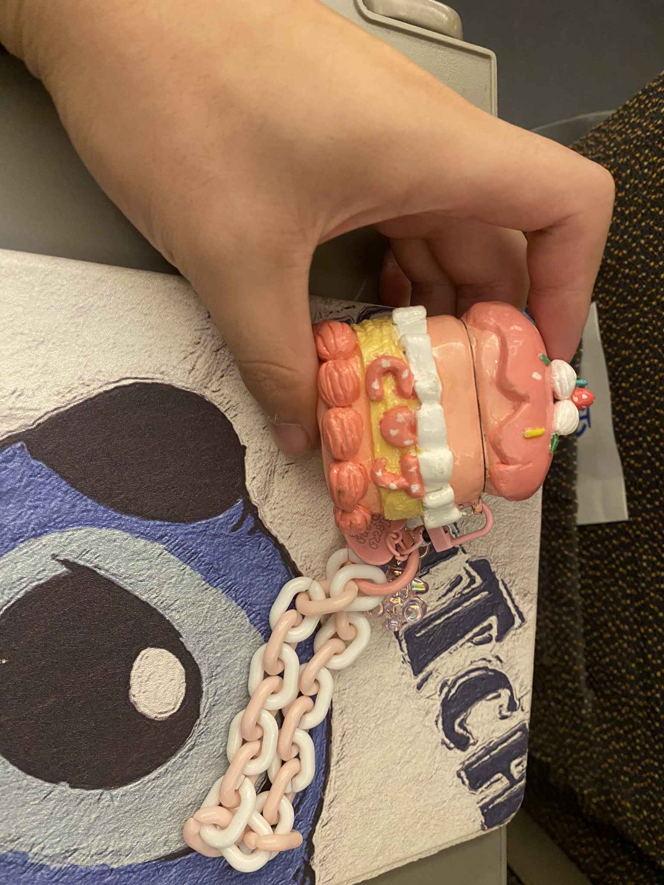
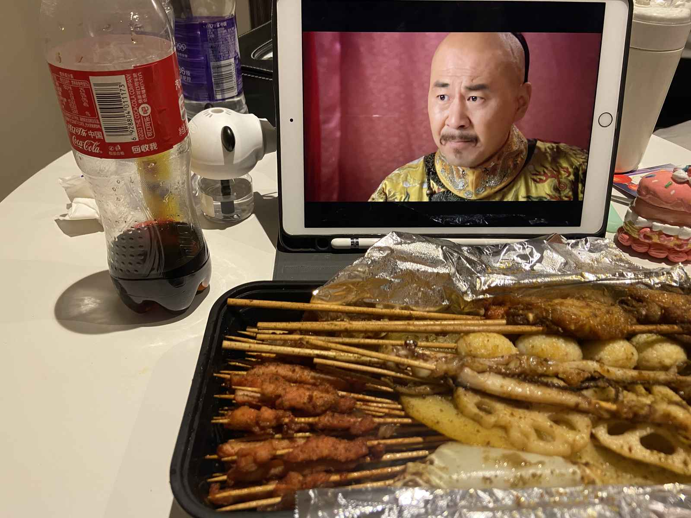
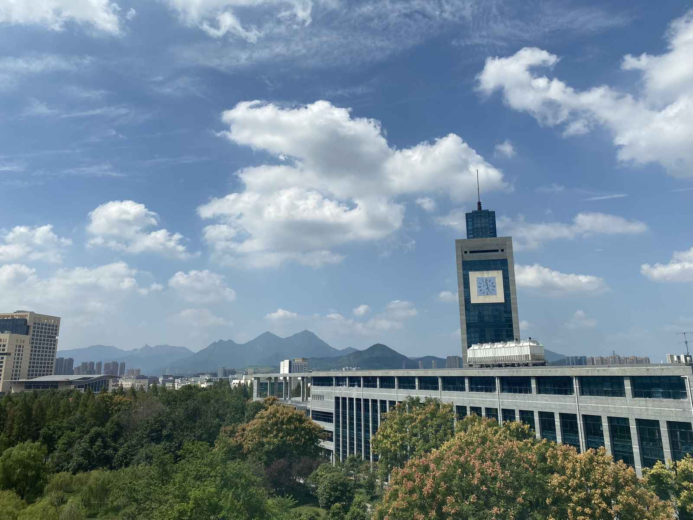
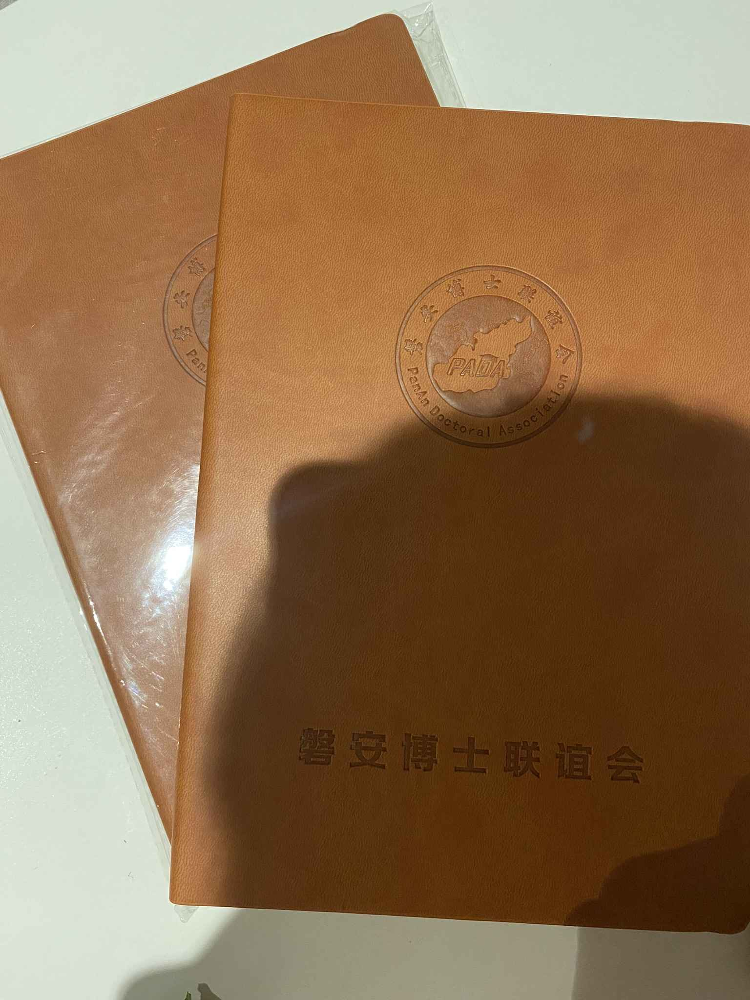
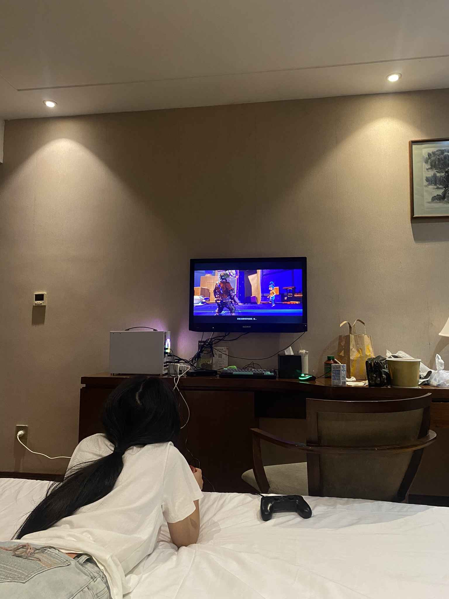
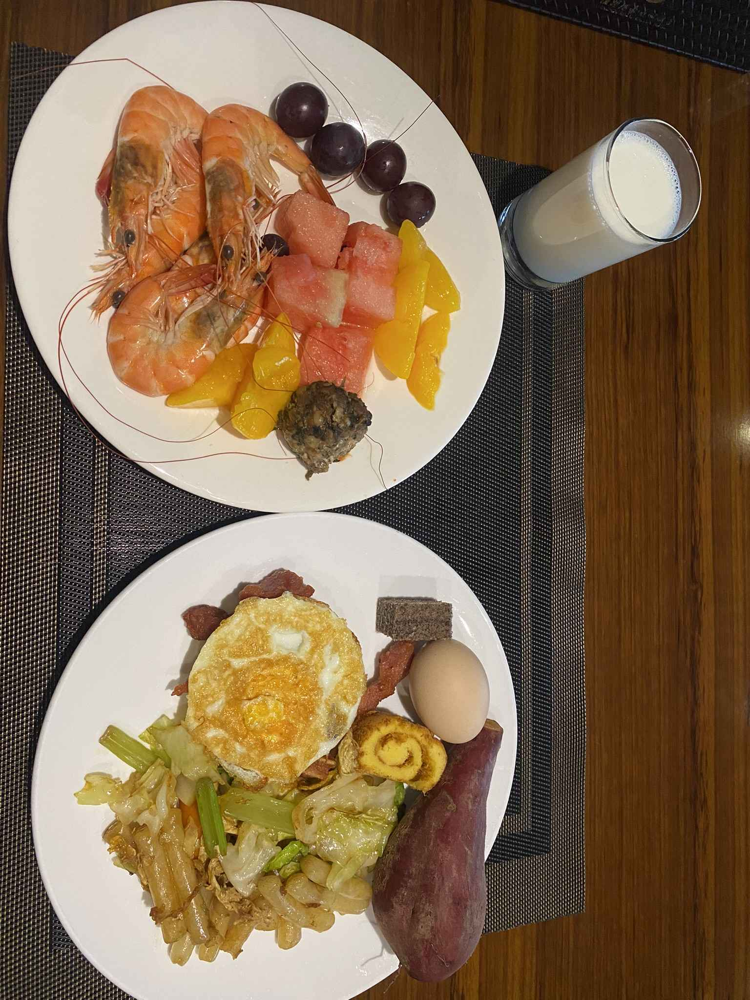
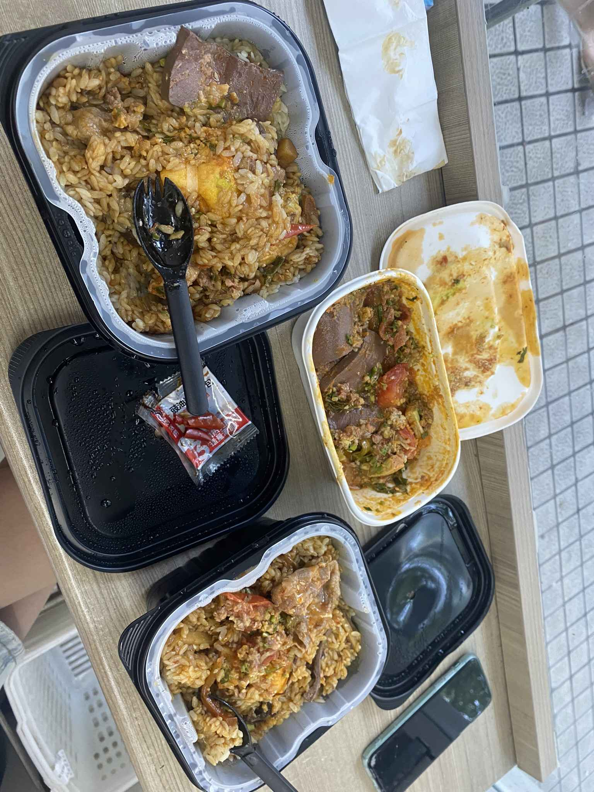
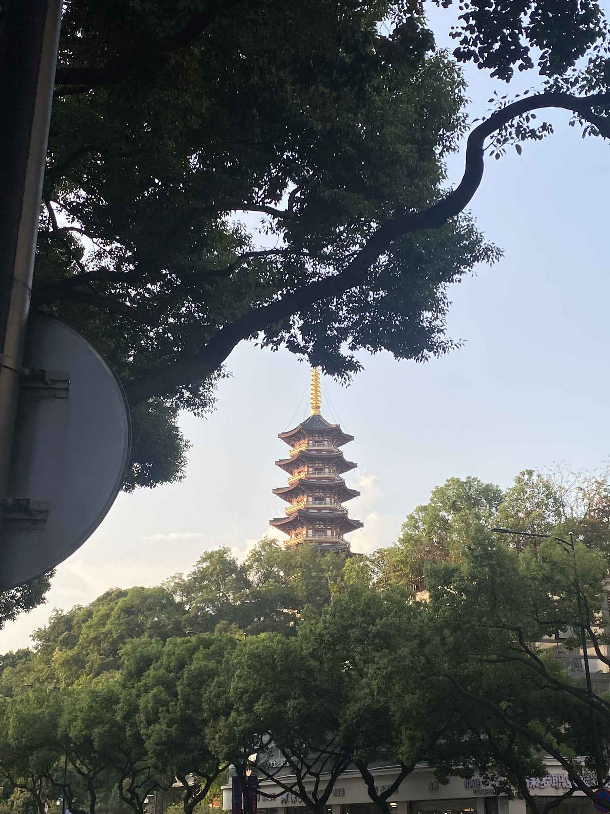
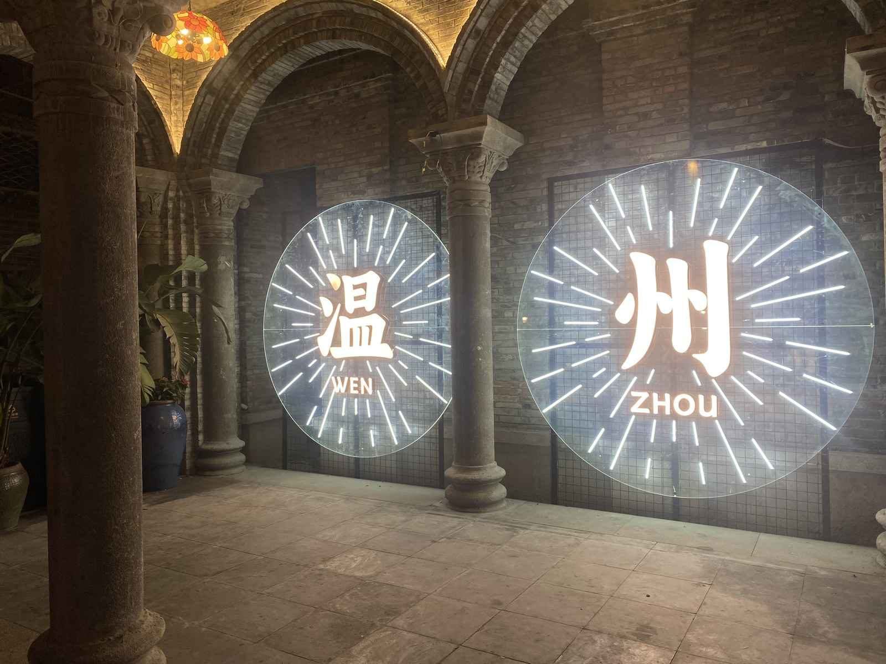

## 🍬 甜蜜开局

在酒店安顿好后，快乐模式正式启动。先来一碗糖水润润喉。

收到了她亲手做的耳机壳！不仅可爱还是独一无二的限量版。必须直接来一个超级特写！

深夜饿意来袭，夜宵烧烤整起！

---

## 🎤 解锁新身份：“过来人”

上午的学子广场阳光明媚，我们在酒店主打一个“躺平”，休养生息。

下午回温医参加了磐安县委人才办主办的活动——**“立志成才 兴磐有我”大学新生第一课**。

这一次，我们作为学长学姐，给刚来的萌新们分享了一些“过来人”的经验。

---

## 🎮 游戏与麦门

活动结束回到酒店，脑力体力消耗过度，急需高热量补充。

没有什么是一顿**麦当劳**解决不了的，如果有，那就两顿。麦门永存！🙏

因为要去市区玩，我们换了一个酒店，这家酒店走的是沉稳的“政务风”，装修非常的“老干部”。

拿出主机连上电视，**《双人成行》** 启动！默契大考验时间到。

不得不夸一句，虽然住宿环境中规中矩，但这里的早餐真的非常不错。

---

## 🚶‍♂️ 漫步温州

退房后，我们在附近的便利店简单解决了一顿午饭，便利店的自热火锅配海底捞也别有一番风味。

剩下的时间，就在温州市区随性地逛了逛。没有特种兵式的打卡，只有漫无目的的citywalk。

