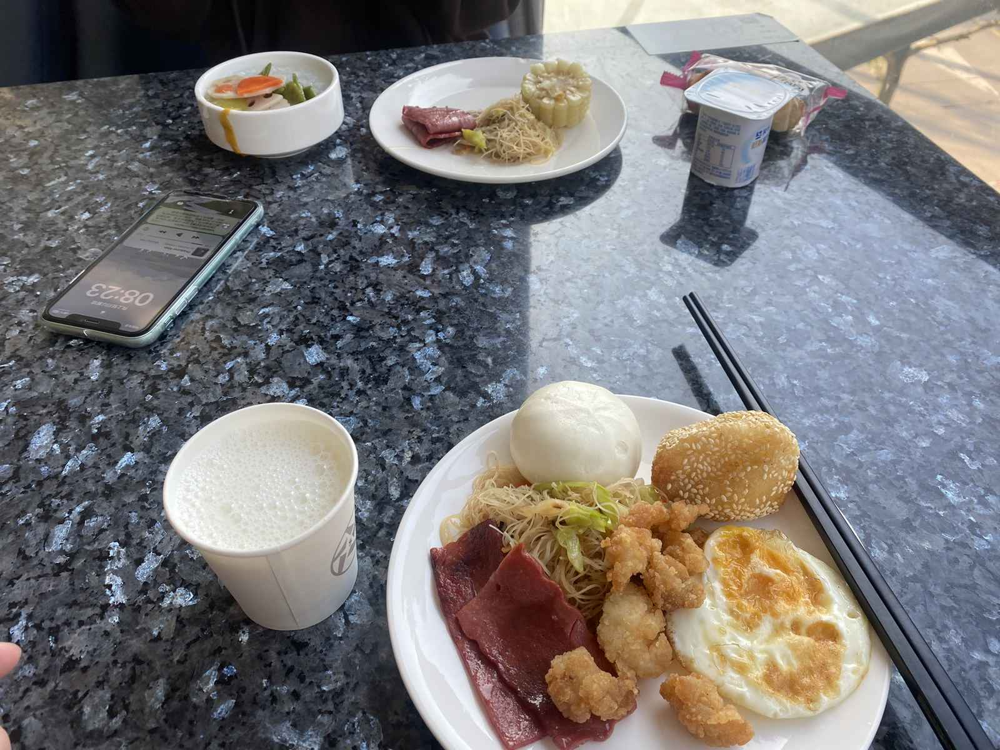
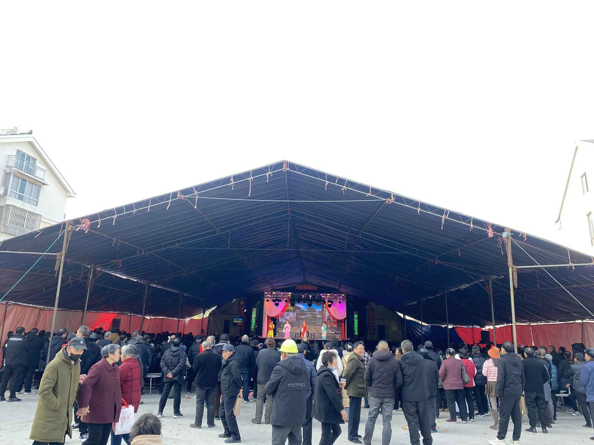
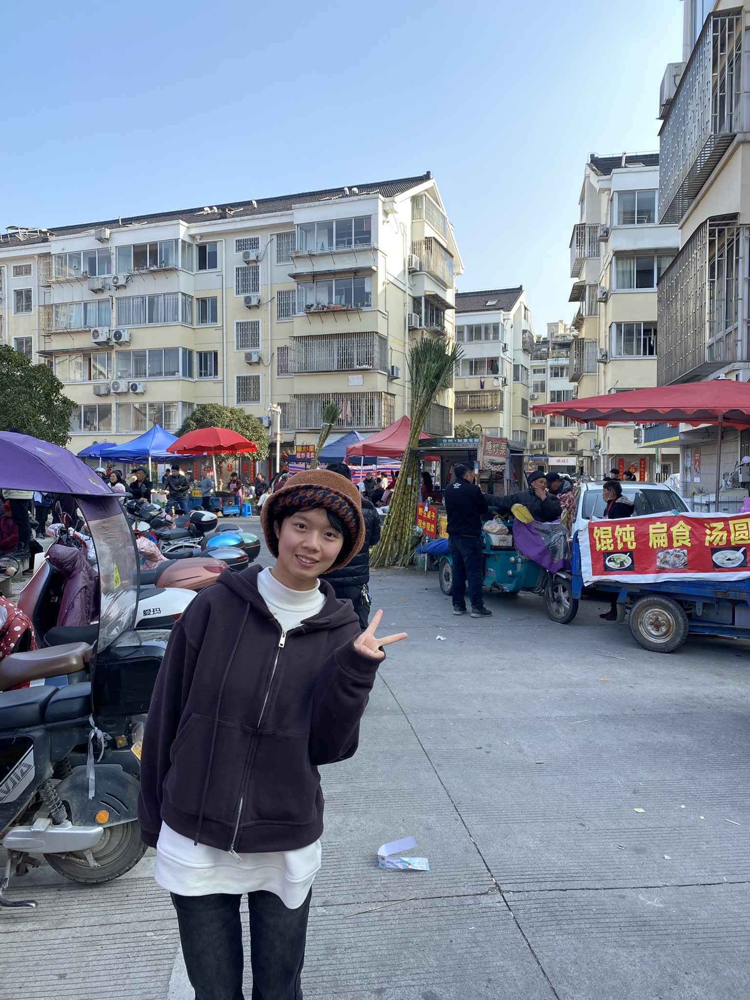
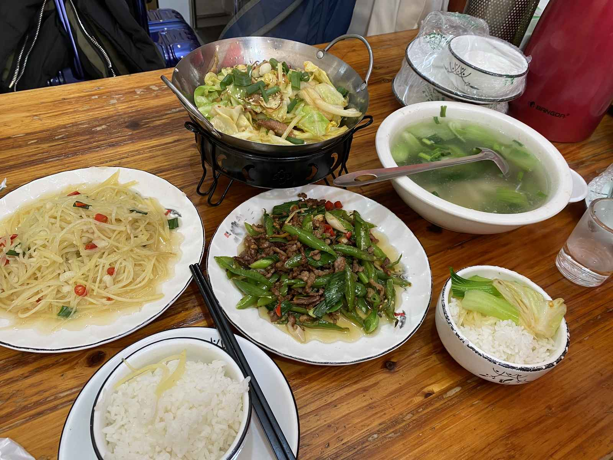
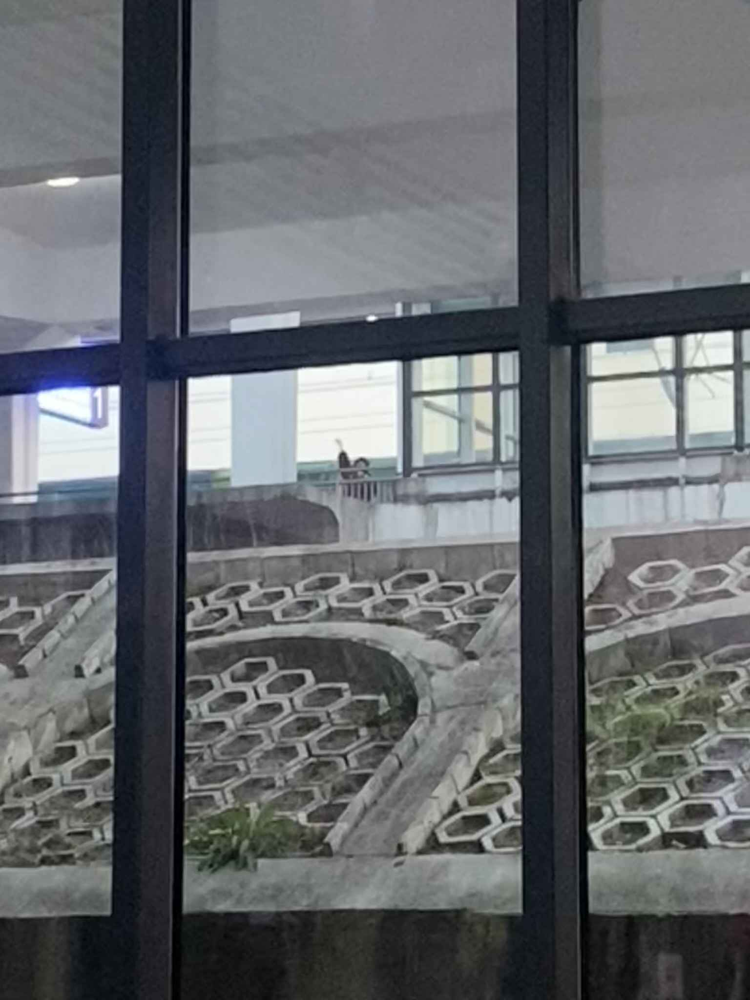

## 📍 中点站：临海

这是年后的第一次见面，也是憋了一个寒假的思念爆发。

这一天，我们做了一道地理题：我从磐安出发，她从温岭启程，我们在地图的中间点——**临海**，完成了一次短暂而热烈的双向奔赴。

## 🍜 市井烟火气

酒店的早饭总是假期醒来的动力之一，简单却满足，开启元气满满的一天。

在附近闲逛的时候，意外闯入了一个老小区。

惊喜地发现里面居然在搭台唱戏，台下坐满了老人。那是属于老临海的市井烟火气，我们驻足看了一会儿，虽然听不太懂，但觉得格外热闹有趣。

## 💇‍♀️ 新发型解锁

对了，这次见到她时，她已经剪了短发啦！（把头发捐给了有需要的人）

比起长发的温婉，短发的她显得更加利落清爽。无论什么发型，依然是我眼里最好看的样子。

## 🌶️ 简单的一餐

午饭没有选什么大餐，随意找了一家**江西小炒**。

充满锅气的家常菜，热辣鲜香，就像我们要溢出来的分享欲，平淡又热烈。

---

## 👋 下次见

相聚的时间总是按分钟计算的。

很快又到了分别的时刻，快门定格下的挥手，是为了下一次更长时间的相聚。

哪怕只是见一面，吃顿饭，充好的电也足够支撑接下来的日子了。

